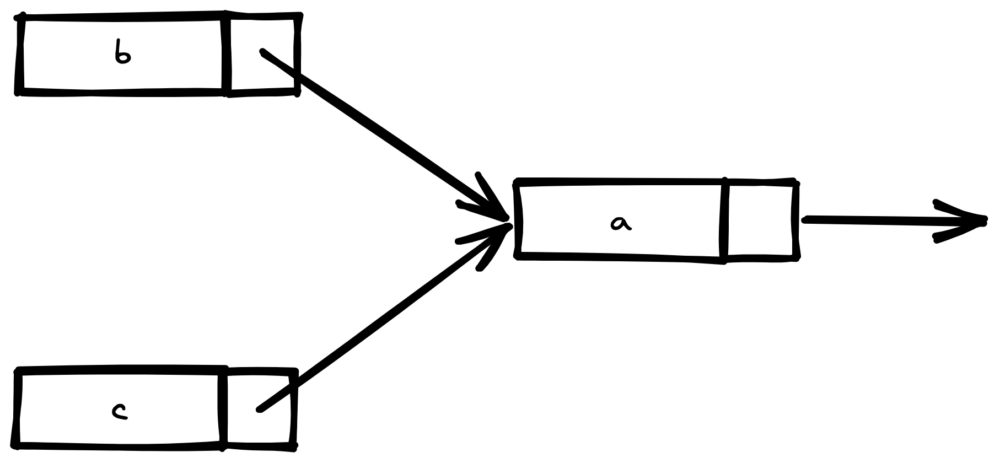

`Smart pointers` are data structures that not only act like a pointer but also have additional
metadata and capabilities.

e.g. `String` and `Vec<T>` are smart pointers. They own some memory and allow to manipulate it.
They also have metadata (such as their capacity) and extra capabilities or guarantees (such as
with `String` ensuring its data will always be valid `UTF-8`).

Smart pointers are usually implemented using structs. The characteristic that distinguishes a
smart pointer from an ordinary struct is that smart pointers implement the `Deref` and `Drop` traits.
The `Deref` trait allows an instance of the smart pointer struct to behave like a reference so
you can write code that works with either references or smart pointers. The `Drop` trait allows
you to customize the code that is run when an instance of the smart pointer goes out of scope.

Examples from standard library:

- `Box<T>` for allocating values on the heap
- `Rc<T>`, a reference counting type that enables multiple ownership
- `Ref<T>` and `RefMut<T>`, accessed through `RefCell<T>`, a type that enforces the borrowing
  rules at runtime instead of compile time

## Box<T>

Boxes allow you to store data on the heap rather than the stack. What remains on the stack is the
pointer to the heap data.

They are used mostly for:

- When you have a type whose size can’t be known at compile time and you want to use a value of
  that type in a context that requires an exact size
- When you have a large amount of data and you want to transfer ownership but ensure the data
  won’t be copied when you do so
- When you want to own a value and you care only that it’s a type that implements a particular
  trait rather than being of a specific type

```rust
fn main() {
    let b = Box::new(5);
    println!("b = {}", b);
}
```

At compile time, Rust needs to know how much space a type takes up. One type whose size can’t be
known at compile time is a recursive type, where a value can have as part of itself another value
of the same type. Because this nesting of values could theoretically continue infinitely, Rust
doesn’t know how much space a value of a recursive type needs. However, boxes have a known size,
so by inserting a box in a recursive type definition, you can have recursive types.

## Linked List

```rust
enum List {
    Cons(i32, Box<List>),
    Nil,
}

use crate::List::{Cons, Nil};

fn main() {
    let list = Cons(1, Box::new(Cons(2, Box::new(Cons(3, Box::new(Nil))))));
}
```

## Deref Trait

Implementing the `Deref` trait allows to customize the behavior of the dereference operator `*`.

A regular reference is a type of pointer, and one way to think of a pointer is as an arrow to a
value stored somewhere else.

```rust
fn main() {
    let x = 5;
    let y = &x;

    assert_eq!(5, x);
    assert_eq!(5, *y);
}
```

The variable `x` holds an `i32` value, `5`. We set `y` equal to a reference to `x`. We can assert
that `x` is equal to `5`. However, if we want to make an assertion about the value in `y`, we have
to use `*y` to follow the reference to the value it’s pointing to (hence dereference). Once we
dereference `y`, we have access to the integer value `y` is pointing to that we can compare with `5`.

Comparing a number and a reference to a number isn’t allowed because they’re different types. We must use the dereference operator to follow the reference to the value it’s pointing to.

It is possible to rewrite this code with `Box<T>`:

```rust
fn main() {
    let x = 5;
    let y = Box::new(x);

    assert_eq!(5, x);
    assert_eq!(5, *y);
}
```

## Custom Smart Pointers

```rust
use std::ops::Deref;

struct MyBox<T>(T);

impl<T> MyBox<T> {
    fn new(x: T) -> MyBox<T> {
        MyBox(x)
    }
}

impl<T> Deref for MyBox<T> {
    type Target = T;

    fn deref(&self) -> &Self::Target {
        &self.0
    }
}
```

Rust substitutes the `*` operator with a call to the `deref` method and then a plain dereference
so we don’t have to think about whether or not we need to call the deref method.

Deref coercion is a convenience that Rust performs on arguments to functions and methods.
Deref coercion works only on types that implement the Deref trait. Deref coercion converts such
a type into a reference to another type. For example, deref coercion can convert `&String` to `&str`
because `String` implements the `Deref` trait such that it returns `&str`. Deref coercion happens
automatically when we pass a reference to a particular type’s value as an argument to a function
or method that doesn’t match the parameter type in the function or method definition. A sequence
of calls to the deref method converts the type we provided into the type the parameter needs.

Example of deref coercion:

```rust
fn hello(name: &str) {
    println!("Hello, {}!", name);
}

fn main() {
    let m = MyBox::new(String::from("Rust"));
    hello(&m);
}
```

Similar to immutable references, you can use the `DerefMut` trait to override the `*` operator
on mutable references.

Rust does deref coercion when it finds types and trait implementations in three cases:

- From `&T` to `&U` when `T: Deref<Target=U>`
- From `&mut T` to `&mut U` when `T: DerefMut<Target=U>`
- From `&mut T` to `&U` when `T: Deref<Target=U>`

The first two cases are the same except for mutability. The first case states that if you have a
`&T`, and `T` implements `Deref` to some type `U`, you can get a `&U` transparently. The second
case states that the same deref coercion happens for mutable references.

## Drop

`Drop`, which lets you customize what happens when a value is about to go out of scope. You can
provide an implementation for the Drop trait on any type, and the code you specify can be used to
release resources like files or network connections. For example, when a `Box<T>` is dropped it
will deallocate the space on the heap that the box points to.

```rust
struct CustomSmartPointer {
    data: String,
}

impl Drop for CustomSmartPointer {
    fn drop(&mut self) {
        println!("Dropping CustomSmartPointer with data `{}`!", self.data);
    }
}

fn main() {
    let c = CustomSmartPointer {
        data: String::from("my stuff"),
    };
    let d = CustomSmartPointer {
        data: String::from("other stuff"),
    };
    println!("CustomSmartPointers created.");
}
```

this will print:

```txt
CustomSmartPointers created.
Dropping CustomSmartPointer with data `other stuff`!
Dropping CustomSmartPointer with data `my stuff`!
```

Variables are dropped in the reverse order of their creation, so `d` was dropped before `c`.

## Reference Counted Smart Pointers

`Rc<T>` - reference counted smart pointer allows to have multiple ownership on same entity.
The `Rc<T>` type keeps track of the number of references to a value to determine whether or not
the value is still in use. If there are zero references to a value, the value can be cleaned up
without any references becoming invalid.



Here `b` and `c` have references to `a`.

This is highly useful in many use cases, for example in graphs and it's derivatives - trees, linked lists e.t.c.

_`Rc<T>` is only for single threaded usecase_

Example of the problem:

```rust
enum List {
    Cons(i32, Box<List>),
    Nil,
}

use crate::List::{Cons, Nil};

fn main() {
    let a = Cons(5, Box::new(Cons(10, Box::new(Nil))));
    let b = Cons(3, Box::new(a));
    let c = Cons(4, Box::new(a));
}
```

This code will not compile, because here multiple ownership of `a` occures, which is not allowed.

Fix it with `Rc<T>`:

```rust
enum List {
    Cons(i32, Rc<List>),
    Nil,
}

use crate::List::{Cons, Nil};
use std::rc::Rc;

fn main() {
    let a = Rc::new(Cons(5, Rc::new(Cons(10, Rc::new(Nil)))));
    let b = Cons(3, Rc::clone(&a));
    let c = Cons(4, Rc::clone(&a));
}
```

Every time we call `Rc::clone`, the reference count to the data within the `Rc<List>` will
increase, and the data won’t be cleaned up unless there are zero references to it.

The call to `Rc::clone` only increments the reference count, which doesn’t take much time. Deep
copies of data can take a lot of time. By using `Rc::clone` for reference counting, we can visually
distinguish between the deep-copy kinds of clones and the kinds of clones that increase the
reference count.

```rust
fn main() {
    let a = Rc::new(Cons(5, Rc::new(Cons(10, Rc::new(Nil)))));
    println!("count after creating a = {}", Rc::strong_count(&a));
    let b = Cons(3, Rc::clone(&a));
    println!("count after creating b = {}", Rc::strong_count(&a));
    {
        let c = Cons(4, Rc::clone(&a));
        println!("count after creating c = {}", Rc::strong_count(&a));
    }
    println!("count after c goes out of scope = {}", Rc::strong_count(&a));
}
```

This will result in:

```rust
count after creating a = 1
count after creating b = 2
count after creating c = 3
count after c goes out of scope = 2
```

**Dereferencing `Rc<T>`:**

To dereference `Rc<T>` used operator `*`, but it is also can be done implicitly. So it
is possible to do:

```rust
let x = Rc::new("value".to_string());
print!("let: {}", x.len());
```

**Moving value from `Rc<T>`:**

Sometimes it is useful to move ownership on the underlying value from `Rc` to somewhere else.
It may be done with `Rc::try_unwrap(rc_pointer)`. But there is a complexity - such move may
be done only in case, when there is only one strong reference exists in this `Rc`. In other
case `try_unwrap` will return an error.

## Interior Mutability And `RefCell`

## Memory Leaks

It is possible to create memory leak in `Rust` with `Rc<T>` or `RefCell<T>` by creating cycle
references. Such a way that one object may reference itself and always having active references
it will not be cleaned.

For example:

```rust
use crate::List::{Cons, Nil};
use std::cell::RefCell;
use std::rc::Rc;

#[derive(Debug)]
enum List {
    Cons(i32, RefCell<Rc<List>>),
    Nil,
}

impl List {
    fn tail(&self) -> Option<&RefCell<Rc<List>>> {
        match self {
            Cons(_, item) => Some(item),
            Nil => None,
        }
    }
}

fn main() {
  let a = Rc::new(Cons(5, RefCell::new(Rc::new(Nil))));

  println!("a initial rc count = {}", Rc::strong_count(&a));
  println!("a next item = {:?}", a.tail());

  let b = Rc::new(Cons(10, RefCell::new(Rc::clone(&a))));

  println!("a rc count after b creation = {}", Rc::strong_count(&a));
  println!("b initial rc count = {}", Rc::strong_count(&b));
  println!("b next item = {:?}", b.tail());

  if let Some(link) = a.tail() {
      *link.borrow_mut() = Rc::clone(&b);
  }

  println!("b rc count after changing a = {}", Rc::strong_count(&b));
  println!("a rc count after changing a = {}", Rc::strong_count(&a));

  // Uncomment the next line to see that we have a cycle;
  // it will overflow the stack
  // println!("a next item = {:?}", a.tail());
}
```

## Preventing Reference Cycles

So far, we’ve demonstrated that calling Rc::clone increases the strong_count of an Rc<T> instance, and an Rc<T> instance is only cleaned up if its strong_count is 0. You can also create a weak reference to the value within an Rc<T> instance by calling Rc::downgrade and passing a reference to the Rc<T>. When you call Rc::downgrade, you get a smart pointer of type Weak<T>. Instead of increasing the strong_count in the Rc<T> instance by 1, calling Rc::downgrade increases the weak_count by 1. The Rc<T> type uses weak_count to keep track of how many Weak<T> references exist, similar to strong_count. The difference is the weak_count doesn’t need to be 0 for the Rc<T> instance to be cleaned up.

Strong references are how you can share ownership of an Rc<T> istance. Weak references don’t express an ownership relationship. They won’t cause a reference cycle because any cycle involving some weak references will be broken once the strong reference count of values involved is 0.

Because the value that Weak<T> references might have been dropped, to do anything with the value that a Weak<T> is pointing to, you must make sure the value still exists. Do this by calling the upgrade method on a Weak<T> instance, which will return an Option<Rc<T>>. You’ll get a result of Some if the Rc<T> value has not been dropped yet and a result of None if the Rc<T> value has been dropped. Because upgrade returns an Option<Rc<T>>, Rust will ensure that the Some case and the None case are handled, and there won’t be an invalid pointer.

As an example, rather than using a list whose items know only about the next item, we’ll create a tree whose items know about their children items and their parent items.

## Tree

```rust
use std::cell::RefCell;
use std::rc::{Rc, Weak};

#[derive(Debug)]
struct Node {
    value: i32,
    parent: RefCell<Weak<Node>>,
    children: RefCell<Vec<Rc<Node>>>,
}

fn main() {
    let leaf = Rc::new(Node {
        value: 3,
        parent: RefCell::new(Weak::new()),
        children: RefCell::new(vec![]),
    });

    println!(
        "leaf strong = {}, weak = {}",
        Rc::strong_count(&leaf),
        Rc::weak_count(&leaf),
    );

    {
        let branch = Rc::new(Node {
            value: 5,
            parent: RefCell::new(Weak::new()),
            children: RefCell::new(vec![Rc::clone(&leaf)]),
        });

        *leaf.parent.borrow_mut() = Rc::downgrade(&branch);

        println!(
            "branch strong = {}, weak = {}",
            Rc::strong_count(&branch),
            Rc::weak_count(&branch),
        );

        println!(
            "leaf strong = {}, weak = {}",
            Rc::strong_count(&leaf),
            Rc::weak_count(&leaf),
        );
    }

    println!("leaf parent = {:?}", leaf.parent.borrow().upgrade());
    println!(
        "leaf strong = {}, weak = {}",
        Rc::strong_count(&leaf),
        Rc::weak_count(&leaf),
    );
}
```

## References

[Reference Cycles](https://doc.rust-lang.org/stable/book/ch15-06-reference-cycles.html)
[Using Box<T> to Point to Data on the Heap](https://doc.rust-lang.org/stable/book/ch15-01-box.html)
